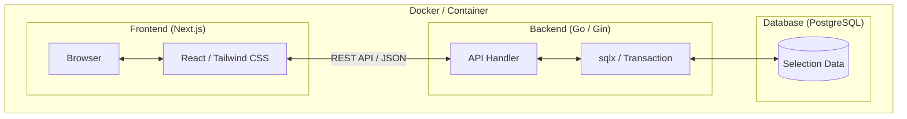

# FlowHedge 🌿

就活の選考ステータスを志望群ごとに管理し、選考ステップを自由に入れ替えられる進捗管理ツールです。
カレンダー連携による予定の重複検知や、直感的な並び替え機能を備えています。


## 🚀 特徴

- **志望群別管理**: 第一志望群〜検討中まで、企業をフェーズごとに整理。
- **柔軟なステップ操作**: 面接やESなどのステップを、ボタン一つで優先度順に入れ替え可能。
- **カレンダー重複検知**: 予定の開始・終了時間を設定し、過密スケジュールを視覚的に警告。
- **モダンな技術スタック**: Go (Gin) + Next.js (TypeScript) による高速な動作。

## 🛠 技術スタック

| Category | Technology |
| :--- | :--- |
| **Frontend** | Next.js 15, TypeScript, Tailwind CSS, Lucide React |
| **Backend** | Go 1.22+, Gin, sqlx |
| **Database** | PostgreSQL 15 |
| **Infrastructure** | Docker, Docker Compose |

## 📦 セットアップ (Local)

Ryzen 7 7800X3D 環境で動作確認済み。Dockerを使用して一瞬で環境を構築できます。

### 1. リポジトリをクローン
```bash
git clone [https://github.com/あなたのユーザー名/flow-hedge.git](https://github.com/あなたのユーザー名/flow-hedge.git)
cd flow-hedge
```
### 2. 環境変数の準備
.env.example をコピーして .env を作成します。

```Bash
cp .env.example .env
```

### 3. 起動
```Bash
docker compose up --build
```
- Frontend: http://localhost:3000
- Backend API: http://localhost:8080

## 🏗 システム構成

## 💡 こだわりポイント
- データ整合性の追求: ステップの並び替えには、フロントエンドの配列操作とバックエンドのトランザクション処理を組み合わせた一括更新APIを実装し、不整合が起きない設計にしています。
- 快適な開発体験: Docker Composeによるコンテナ化により、環境に依存せず誰でもすぐに開発を開始できます。

## 📅 今後のロードマップ
- [ ] Supabase / Render を活用したクラウドデプロイ
- [ ] 面接対策用の「逆質問リスト」管理機能
- [ ] 選考状況の統計ダッシュボード（円グラフ等）
- [ ] 企業ごとのデータを比較検討する機能